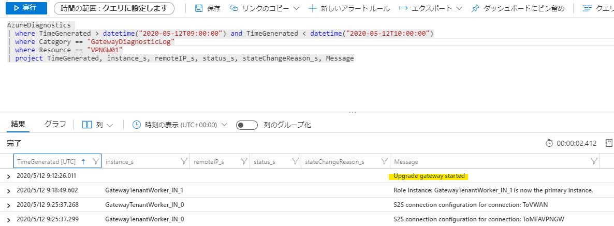
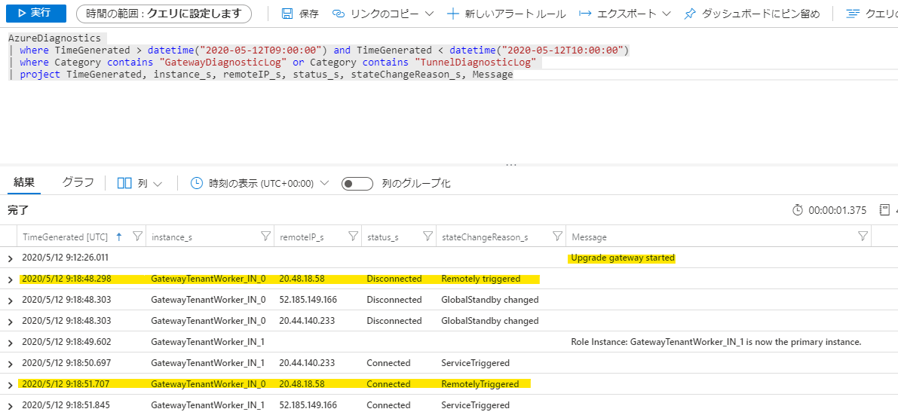

# Azure VPN ゲートウェイにメンテナンスがあったかどうか確認する方法

こんにちは、Azure サポートチームの米川です。

今回は VPN ゲートウェイの S2S VPN 接続をご利用のお客様向けに、
VPN 接続断がメンテナンス起因で発生したのかどうかを確認する方法をご紹介いたします。


IPsec VPN はその性質上、非常に多岐にわたる要因により通信断を引き起こします。  
その要因の一つとして、Azure 基盤側のメンテナンスがあります。

Azure はクラウドサービスであるために、非常に多岐にわたるメンテナンスが実施されています。  
仮想ネットワークゲートウェイの基盤側のメンテナンスが実施された場合、VPN 接続が一度ダウンするため、再度 VPN 接続がアップするまでに数十秒程度の通信断が発生する場合がございます。  
そのため、実際に VPN 接続断が発生した際に、それがメンテナンスによる通信断かどうかの切り分けを行うことが可能となります。
  
**メンテナンスの日時を事前に把握する方法ではなく、あくまでも事後に確認する方法になりますのでご留意ください。**


## ■ メンテナンスの有無は、診断ログの GatewayDiagnosticLog より確認が出来ます

現在、Azure VPN Gateway の診断ログには、下記の診断ログがございます。

* **GatewayDiagnosticLog**   
ゲートウェイ構成イベント、主要な変更、メンテナンス イベントのリソース ログが含まれています  
* **TunnelDiagnosticLog**  
トンネルの状態変更イベントが含まれています。 トンネルの接続/切断イベントには、状態変更の理由の概要があります (該当する場合)  
* **RouteDiagnosticLog**  
ゲートウェイで発生する静的ルートへの変更および BGP イベントがログに記録されます  
* **IKEDiagnosticLog**  
ゲートウェイ上の IKE コントロールのメッセージおよびイベントがログに記録されます  
* **P2SDiagnosticLog**  
ゲートウェイ上のポイント対サイト コントロールのメッセージおよびイベントがログに記録されます。 接続ソース情報は IKEv2 接続に対してのみ提供されます  

(ご参考)   
[VPN Gateway からのリソース ログ イベントにアラートを設定する](https://docs.microsoft.com/ja-jp/azure/vpn-gateway/vpn-gateway-howto-setup-alerts-virtual-network-gateway-log)


上記診断ログのうち、**GatewayDiagnosticLog** に、メンテナンスの情報が記録されます。  
具体的には、メンテナンスがあった場合、"Message" フィールドに"Upgrade gateway started" が表示されます。

### 出力例 :  


## TunnelDiagnosticLog と同時に表示させると切断時間も確認出来ます   
下記のように、TunnelDiagnosticLog と並べて表示させることで、メンテナンスによる切断・再接続のタイミングも確認することが可能です。

### 出力例 :   


## ■ 診断ログの設定方法

診断ログの設定方法は、下記ドキュメントの手順 6 まで実施いただくことで設定が可能です。

[VPN Gateway からのリソース ログ イベントにアラートを設定する](https://docs.microsoft.com/ja-jp/azure/vpn-gateway/vpn-gateway-howto-setup-alerts-virtual-network-gateway-log)

※手順 7 以降はアラートを通知したい場合の設定となります。

## ■ 診断ログのクエリ例

たとえば、下記のようなクエリを出力先の Log Analytics ワークスペース上で実施いただくことで、
"TunnelDiagnosticLog" と "GatewayDiagnosticLog" を検索することが可能です。

```
AzureDiagnostics 
| where Category == "GatewayDiagnosticLog" or Category == "TunnelDiagnosticLog" 
| project TimeGenerated, instance_s, remoteIP_s, status_s, stateChangeReason_s, Message
```

リソース名でフィルターしたい場合は、下記のように "Resource" フィールドを追加してください。
```
AzureDiagnostics 
| where Category == "GatewayDiagnosticLog" or Category == "TunnelDiagnosticLog" 
| where Resource == "VPNGW01"
| project TimeGenerated, instance_s, remoteIP_s, status_s, stateChangeReason_s, Message
```

## ご留意事項
* VPN ゲートウェイは内部的に 2 インスタンスから構成されるため、メンテナンスも両インスタンスに対して実施されます。そのため、数十分間隔で 2 度の通信断が発生する場合がございます。
* すべてのメンテナンスが記録されるわけではないため、メンテナンスの種類によっては上記のログに反映されない場合もあります。
* VPN 接続断の原因調査を行う上で、もしも上記のログにメンテナンスの形跡がなく、かつオンプレミス側にも問題が見受けられない場合には、サポートチームまでお気兼ねなくお問い合わせください。

本情報の内容（添付文書、リンク先などを含む）は、作成日時点でのものであり、予告なく変更される場合があります。