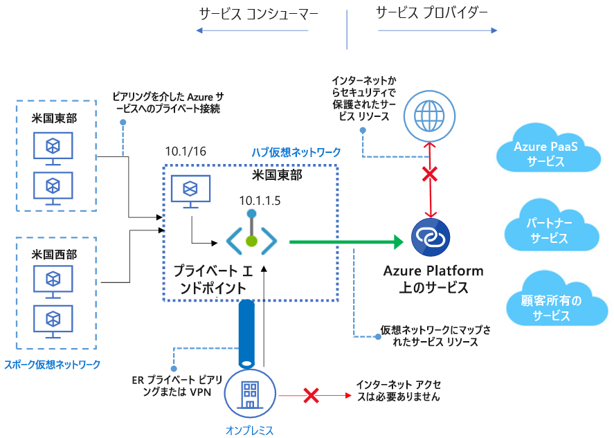
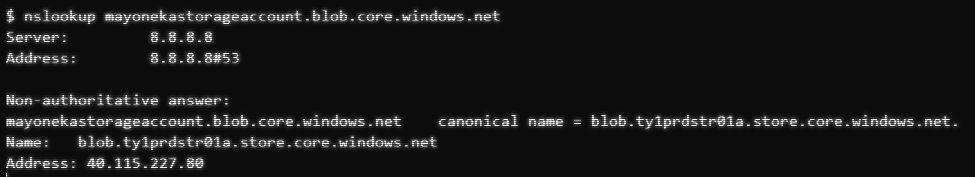
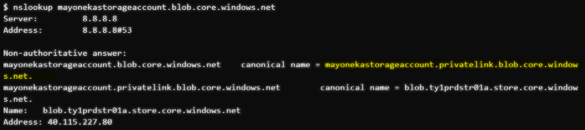
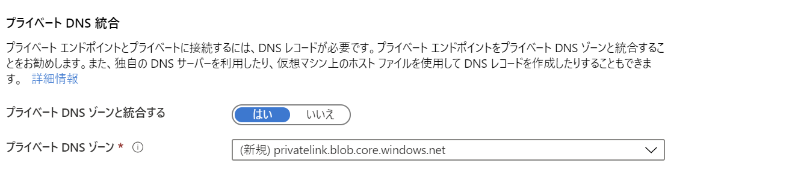
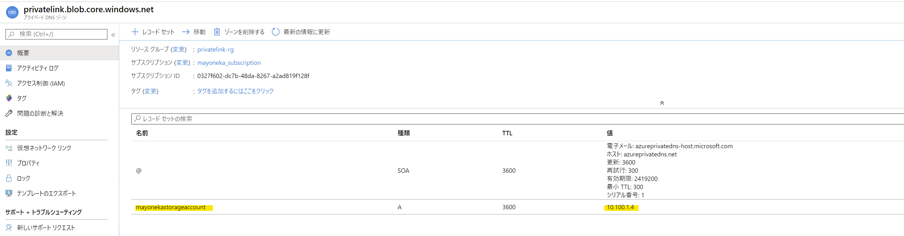

# Private Link について

こんにちは、Azure Networking 担当の米川です！

最近、Private Link のご利用を検討いただいている方が増えてきているように思えますが、サービスエンドポイントとの違いや、プライベートエンドポイントと Private Link の関係、DNS の設定方法など、まだ慣れない部分が多いかと思います。

このブログでは、そういったポイントについて解説していこうと思います。

## Private Link は Private Endpoint と Private Link Service の総称
Private Link のドキュメントを読んでいただくと、プライベートエンドポイントだったり、プライベートリンクサービスだったり、
似たような言葉が多く並んでいるかと思います。

結論から言うと、**プライベートリンクはプライベートエンドポイントとプライベートリンクサービスの総称**となります。

* Private Endpoint

   Azure PaaS サービスや、独自に作成した Private Link サービスに対してプライベートエンドポイント (プライベート IP アドレス) を提供するサービス

* Private Link サービス

    独自に作成したサービス (Standard Load Balancer の背後に存在するアプリケーション群) に対して、プライベートエンドポイントを作成できるようにするサービス

Private Link と Private Link サービスがあることで混乱しやすいですが、
Private Link (Private Endpoint 含む) と、Private Link サービスは、それぞれ異なる意味を持ちます。

ここでは、まず Private Endpoint について説明していきます。

## Private Endpoint とは

従来、Azure パブリック サービス (PaaS サービス) はパブリック IP アドレスでのアクセスだけが可能でした。  
これをお客様のネットワークに閉じたい場合、App Service でいう App Service Environment など、PaaS サービス自体を仮想ネットワーク上に構築するような機能が必要です。  
しかし、ストレージアカウントなど、中にはそういった構成が出来ない PaaS サービスもあり、そういったサービスについてはプライベート IP 経由で通信することが出来ないため、PaaS サービス側のファイアウォールなどで最低限必要なパブリック IP アドレスを許可するような運用が必要でした。  
また、サービスエンドポイントを使用する構成もありますが、サービスエンドポイントを使用しても宛先 IP アドレスはパブリック IP アドレスのままなので、オンプレミス側から VPN 経由や ExpressRoute (Private Peering) 経由で接続できないという問題もありました。

そこで登場したのがプライベートエンドポイントです。

プライベートエンドポイントを作成すると、特定の PaaS サービスに対するプライベートエンドポイントが、
作成時に指定したサブネット内に作成されます。  
プライベートエンドポイントに対して、対象のサブネットからプライベート IP アドレスが払い出されるため、
ユーザーはそのプライベート IP アドレスに通信することで、対象の PaaS サービスに通信することが可能となります。  
勿論、VPN や ExpressRoute のプライベートピアリング経由でも通信することが可能になります。  

 

プライベートエンドポイントにより、パブリック エンドポイント (パブリック IP アドレス) を経由して Azure PaaS サービスにアクセスさせる必要がなくなり、より柔軟なネットワーク構成が可能になりました。

## Private Endpoint の作成方法

具体的な作成方法については下記ドキュメントに纏められております。

(ご参考)  
クイック スタート:Azure portal を使用してプライベート エンドポイントを作成する  
https://docs.microsoft.com/ja-jp/azure/private-link/create-private-endpoint-portal

## DNS 構成について
Private Endpoint を使用する際に混乱しやすいポイントとして、DNSの設定方法があります。  
まず知っておいていただきたい点として、Private Endpoint は**プライベート IP アドレスを提供するサービスであり、Azure PaaS サービスのFQDN をプライベート IP に名前解決してくれる機能は持ちません。**  
つまり、Private Endpoint 以外の何かしらの方法で、対象の FQDN をプライベート IP アドレスに変換させる仕組みが必要となります。

この DNS の設定に際して、Private Endpoint 有効化時に Azure 側で追加される private link 用の DNS ゾーン (`privatelink.xxx.net`) が重要になります。  

例として、ストレージアカウント (FQDN : `mayonekastorageaccount.blob.core.windows.net`) について、プライベートエンドポイント無効化時と有効化時の名前解決の結果を比較してみます。

#Private endpoint 無効化時の名前解決結果

 

`mayonekastorageaccount.blob.core.windows.net ` の名前解決先として、
`blob.ty1prdstr01a.store.core.windows.net` が応答されていることがわかります。

#Private endpoint 有効化時の名前解決結果

 

`mayonekastorageaccount.blob.core.windows.net ` の名前解決先として、
`privatelink.blob.core.windows.net` が応答されています。  
この `privatelink.xxx` のゾーンが追加されることで、ユーザーは DNS サーバーにこのゾーンを追加し、対象のホスト名に対応するレコードを追加するだけで、
Private Endpoint に名前解決させることが可能となります。

以上を踏まえて、プライベートエンドポイントの DNS 設定として弊社が推奨している下記 3 つの方法について説明をしていきます。

### 1. Hosts ファイルを使用する (運用環境では非推奨)
この方法は、Azure PaaS サービスに使用される FQDN をプライベート IP アドレスに名前解決するよう、
アクセス元の端末の Hosts ファイルに追記する方法です。  
ドキュメントにも記載がありますが、この方法はテスト環境でのみ推奨されております。

### 2. Private DNS ゾーンを使用する (Azure 仮想ネットワーク上のリソースに対してのみ有効)
Private DNS ゾーンとは、Azure 内部で提供される DNS サーバー (168.63.129.26) をご利用時に、
Private DNS ゾーンとリンクされた仮想ネットワーク内のリソースに独自のゾーンを参照させることが可能になるサービスです。  
例えば、仮想ネットワーク A に対して `example.com` のゾーンを持つ Private DNS ゾーン リソースを作成すると、
仮想ネットワーク A 内のリソースが DNS サーバー (168.63.129.26) に名前解決する際に、
`example.com` の Private DNS ゾーンを参照させることが可能になります。

ご留意点として、DNS サーバー (168.63.129.26) のご利用が必須になるため、**カスタム DNS を使用している場合と、オンプレミス側から名前解決する場合には、ご利用いただけません**  
※ DNS サーバー (168.63.129.26) は Azure からのアクセスのみ許可されている IP アドレスになります。  
※ カスタム DNS サーバーのフォワード先としてDNS サーバー (168.63.129.26) を指定する方法もございます。

この機能を利用して、Private Endpoint 有効化時に利用可能なゾーン (`privatelink.xxx`) に対応する Private DNS ゾーンを作成し、
そのゾーン内に、Private Endpoint (プライベート IP アドレス) に対応する A レコードを追加することで、
簡単にプライベートエンドポイント用の DNS 設定を構成することが可能です。

この方法は、Private Endpoint 作成時に「プライベート DNS 統合」を有効化することでも可能となります。

 

上記のストレージアカウントの場合、下記のようなPrivate DNS ゾーンが自動で作成されます。

 

### 3. 独自の DNS サーバーを使用する

## Private Link サービスとは

## プレビュー状況について

## よくあるご質問
### 1. サービスエンドポイントとプライベートエンドポイントの違いは？

### 2. プライベート DNS ゾーンを設定したのに、仮想ネットワークピアリング先のリソースから名前解決できない

### 3. Private Endpoint が属するサブネットの NSG が意図した通りに機能しない

### 4. Private Endpoint が属するサブネットの UDR が意図した通りに機能しない